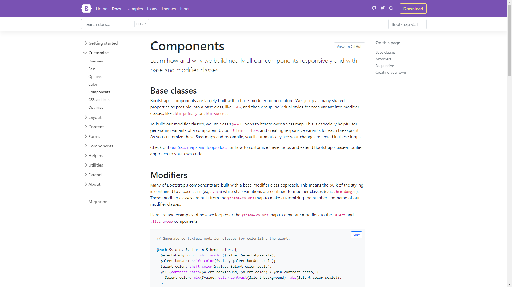
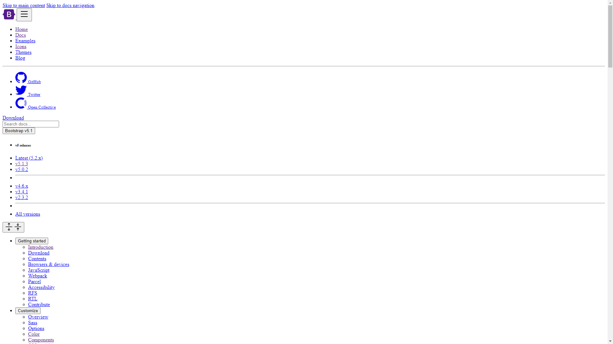

Times New Roman, left aligned, black-and-white text. By default, that is the underlying appearance of all websites. CSS can style the basic HTML into a modern website, but this requires significant time and effort.

## UI Frameworks

UI Frameworks give web developers a "shortcut" to building websites. Rather than defining the appearance of each individual item through CSS, UI frameworks like Bootstrap allow a developer to describe each item on a webpage as a class already defined in the framework. The framework applies a consistent and responsive style to all elements on the page. 

In addition to styling, Bootstrap also provides functionality shortcuts, such as implementing dropdown menus and item positioning, without needing to delve deep into the CSS. If necessary, however, aspects of the styling can be overridden with custom CSS. This means Bootstrap can offer a good starting point to further customize a website.

## An Example

For instance, here is a page from the Bootstrap 5.0 documentation both with and without Bootstrap:

By removing the references to Bootstrap's CSS, every HTML element is essentially reverted to its browser default version.

## Risks of using Bootstrap

There is a risk of a website appearing too generic by using only the default styling of Bootstrap, which is why the creativity of a designer is important in developing an attractive and functional website. Much like the default style of 90s websites, the overreliance on default styling can make a website look too generic.

But for a novice web developer, especially one without much experience in aesthetics, Bootstrap is a great way to start building a website. Clearly, modern website design is made easier and faster with UI frameworks like Bootstrap.