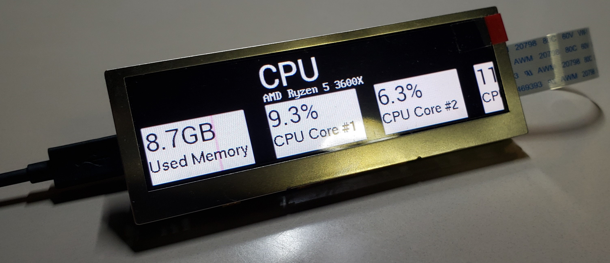

  

I built a PC Status Monitor device that would connect to a PC via USB to display hardware usage statistics and sensor readings on a a continously scrolling display. 

The system consisted of:
- A [Crystalfontz 480x128 3.9" Bar-Type EVE Display](https://www.crystalfontz.com/product/cfaf480128a0039tna11-480x128-eve-1u-display)
- A [Teensy 4.0](https://www.pjrc.com/store/teensy40.html)
- A custom PCB to hold the Teensy and display

I also built a simple console program to run on the host PC in C#. This program used the [OpenHardwareMonitor](https://openhardwaremonitor.org/) API to collect sensor values and transmit them as serial values to the Teensy. The Teensy would then "unpack" the data and signal the display's EVE processor to update with the most recent readings.

In this project, I:
- Applied object-oriented programming concepts I learned in the previous semester. Hardware sensors were represented as objects in a linked list.
- Designed a custom PCB using EDA software. The Teensy was socketed for easy troubleshooting and power/data connections were shared, requiring only a single microUSB connection to function.
