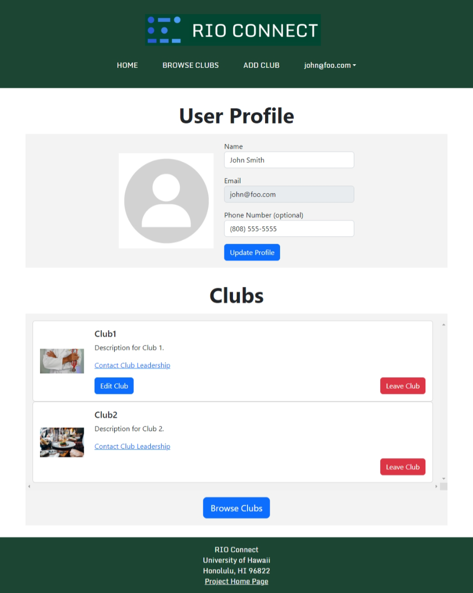
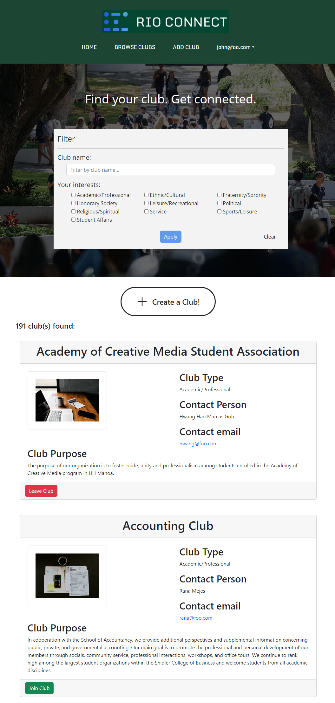
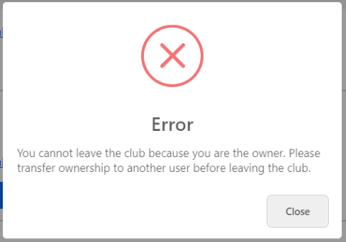
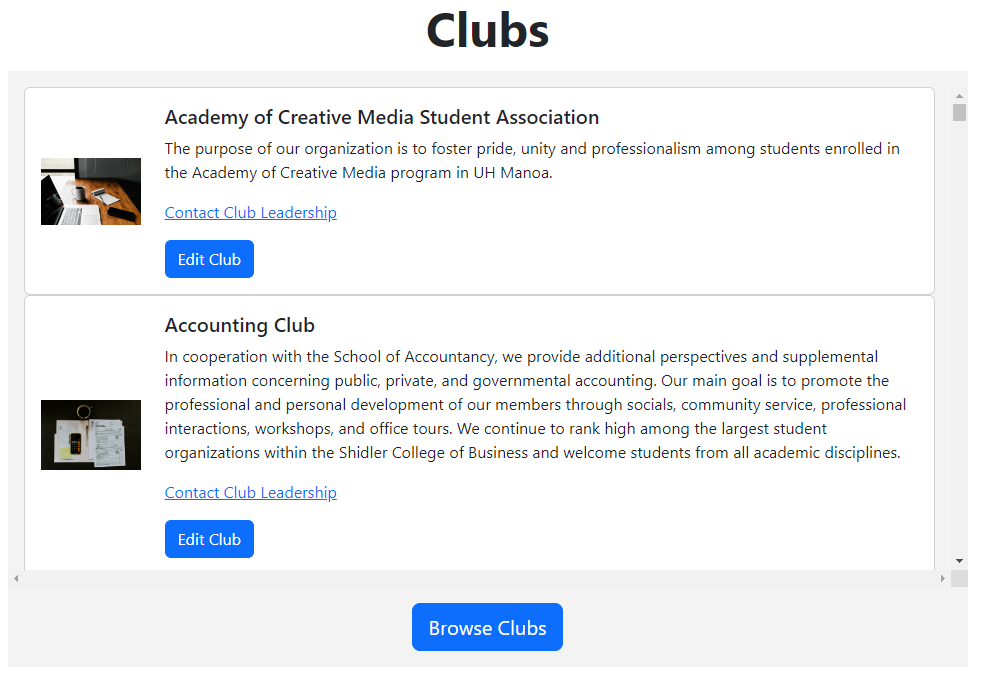
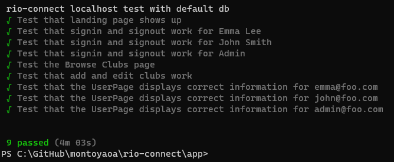

[RIO Connect](https://rio-connect.com/) is a website made to connect students and clubs at the University of Hawaii at Manoa. Registered Independent Organizations (RIOs) are student-run clubs at UH Manoa. This was a group project for ICS 314, Software Engineering, and I was a member of a five-person team developing this website. My contributions to the project were the user page, browse clubs page, and writing tests.

## User Page
My primary contribution to the project was the design of the user page, which holds information about the currently logged in user and the clubs they are a member of. The top-level UserPage holds references to the user's profile data and their club data, and passes that data to its child components. 

There are two child components: one for the user's profile information, and another for the user's clubs. 

The profile component holds the user's profile picture (a placeholder image) and a form pre-filled with the user's profile information. Changing either the name of phone number fields and pressing "Update Profile" would invoke a callback function that would update the user's profile information in the parent UserPage.

The clubs list component holds a list of all the clubs that the user has joined. The list component is in fact a list of club card components, which define the look of each entry in the list. This club card contains the name of the club, its description, and a link to email the owner of the club. Additionally, there are two buttons:
- If the user owns the club, they see an "Edit Club" button, which links to the edit club page for that particular club.
- A button to leave the club. Pressing this button invokes a callback function that deletes the user's username from the club's roster. The user's clubs list is then updated, reflecting the deleted club.

Below is a screenshot of the user page.

## Browse Clubs Page
This page shows a list of all available clubs. My contribution to this page was improving the design of the club cards that display club information, and adding join/leave club functionality. The top-level BrowseClubsPage holds references to all clubs, and passes that data to each child component.

There are two child components: one for the club filtering, and another for the clubs list.

The club filter is a form that allows the user to specify which clubs they are interested in seeing. When the fields are set and the "Apply" button is pressed, a callback function is invoked that passes the filter criteria to the parent BrowseClubsPage. This criteria is then passed to the clubs list to be applied on all clubs.

The clubs list contains club cards that contain information on clubs. It filters the clubs it displays using the criteria passed into it from the parent BrowseClubsPage. Each club card in the list has the club's name, type, owner's name and email address, and description. If the user is logged in, there is also a button to join or leave the club corresponding to the user's status in that club. Pressing that button will invoke a callback function that writes or deletes that user's username from the club roster as appropriate.

Below is a screenshot of the browse clubs page.

## Testing
I also wrote tests for the user page using TestCafe. These tests ensured that the user page loaded the correct information for three types of users: users who are not owners of any clubs, users who own clubs, and Admins. For each user, the following tests were run:
- The user is logged in.
- The user navigates to the user page.
- The user's information is verified to be correct. This includes both their profile information, and the clubs they are a member of.
- The user's profile information is edited. It is then verified to ensure that the change took.
- The user's profile information is restored.
- The user attempts to leave all clubs they are a member of.
- The user rejoins all clubs they left in the previous step.
- The user logs out.

The tests were designed to be invariant, that is, any changes made during the test were restored to their original state after the test. This ensures that following tests can work with the same assumptions.

The tests had to deal with edge cases based on the type of user. For instance, a club owner should not be able to leave a club they own. Doing so triggers an error informing the user that they need to transfer ownership to ensure the club is not orphaned.

Similarly, Admins can edit, but are not a member of, any club at all. They should not have the option to leave or join clubs.

These tests were run locally before being uploaded to GitHub. They are then run using GitHub Actions as part of a Continuous Integration (CI) pipeline to verify code standards are being met. I encountered issues with my tests using GitHub Actions, which was due to their complexity. Initially, my tests would navigate across multiple pages, which led to failures due to loading timeouts. I simplified and reduced the scope of my tests to ensure that the tests passed in a reasonable amount of time while still thoroughly testing functionality. 

## Lessons learned
In this project, I learned quite a bit about true team-based software engineering. I worked with other students of similar experience, and thus we could split the workload much more effectively. I gained experience in using React Bootstrap to design a website, Meteor and MongoDB in managing databases, and TestCafe in writing tests.

[This is a link to the GitHub repo.](https://github.com/rio-connect/rio-connect)

[This is a link to the GitHub.io page with more information on the project.](https://rio-connect.github.io/)