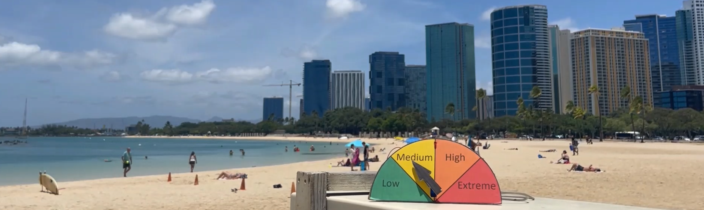
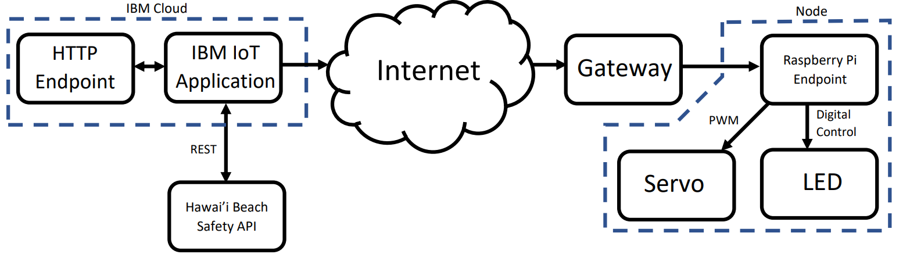

I was a member of a four-person team which built a display system that visually indicated surf conditions to beachgoers. This system consisted of a cloud app, which would collect surf conditions for beaches in Hawaii, and display nodes, which corresponded to an individual beach. At a regular interval, the cloud app would query a live surf conditions dataset, then parse the required beach conditions, sending surf information to each node. 

My role on the team was developing the nodes, representing an individual beach. These nodes consisted of a Raspberry Pi, servo, LED, and cardboard display. I developed the Node-RED flow which would accept incoming surf condition data from the cloud flow and update the display corresondingly. The servo would point an arrow to the appropriate region of the display, and the LED would light if there were an alert on the Hawaii Beach Safety webpage.

In this project, I:
- Assumed a leadership role on the team to assign tasks to team members and integrate member's contributions to the project.
- Used Node-RED to parse data from a REST API.
- Built the node hardware for all four members of the team, resulting in a sucessful demonstration.

[This is a link to the GitHub repo for the cloud and node flows.](https://github.com/montoyaoa/watchtower)
