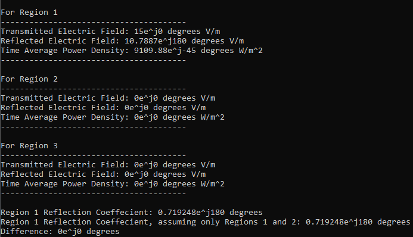

I built a program that would model how an electric field would reflect and transmit through multiple layers of dielectric materials. This was an extra credit assignment for my electromagnetics course, and greatly helped me understand the concepts and calculations of incident electric fields on dielectrics.

The program was written in C++, and run on the command line. The user would provide input on the properties of the electric field, and the number and properties of the dielectric layers. The program would then calculate all relevant properties of the dielectric layers (beyond that which is provided by the user), and the magnitude of the electric field in each dielectric layer. 

In this project, I:
- Applied object-oriented programming concepts I learned in the previous semester. Dielectric layers were represented as objects in a linked list.
- Used the Complex C++ library to perform complex-number calculations in C++.

[This is a link to the GitHub repo.](https://github.com/montoyaoa/EE371Calculator)
